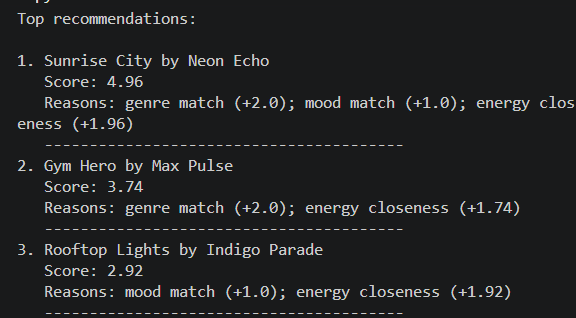
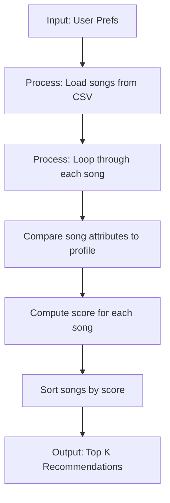

# 🎵 Music Recommender Simulation

## Project Summary

This version of the music recommender simulates a basic content-based recommendation system. It represents songs with attributes like genre, mood, energy, tempo, valence, danceability, and acousticness, and matches them to user profiles defined by favorite genre, mood, target energy, and acoustic preference. The system computes scores by comparing these attributes and recommends the top-matching songs, prioritizing simplicity and transparency to illustrate how real-world recommenders work.



---

## How The System Works

Real-world recommendation systems, like those used by Spotify or Netflix, analyze vast amounts of user data—such as listening history, ratings, and interactions—to predict preferences using techniques like collaborative filtering (finding similar users) and content-based filtering (matching item features). They often incorporate machine learning models to balance personalization with diversity. My version prioritizes simplicity and interpretability, focusing on direct attribute matching between user preferences and song characteristics to demonstrate core concepts without overwhelming complexity.

**Song features used in the simulation:**
- genre
- mood
- energy
- tempo_bpm
- valence
- danceability
- acousticness

**UserProfile information stored:**
- favorite_genre
- favorite_mood
- target_energy
- likes_acoustic

Explain your design in plain language.

Some prompts to answer:

- What features does each `Song` use in your system
  - For example: genre, mood, energy, tempo
- What information does your `UserProfile` store
- How does your `Recommender` compute a score for each song
- How do you choose which songs to recommend

You can include a simple diagram or bullet list if helpful.

### Taste Profile and Recommendation Recipe

**Proposed user taste profile (dictionary):**

```python
user_profile = {
    "favorite_genre": "rock",
    "favorite_mood": "intense",
    "target_energy": 0.90,
    "likes_acoustic": False,
}
```

This profile is designed to differentiate between an "intense rock" listener and a "chill lofi" listener by combining:
- a strong genre preference (`favorite_genre`) to favor rock over lofi,
- a mood preference (`favorite_mood`) to prefer intense tracks,
- an energy target (`target_energy`) to emphasize high-energy songs,
- and an acoustic preference (`likes_acoustic`) to avoid acoustic-heavy tracks when set to `False`.

The profile is specific enough to separate the two styles, but it could be too narrow if the system only relies on exact genre and mood matches. For example, a chill song with an intense feel or a rock song with a mellow mood may be missed unless energy and acousticness also contribute meaningfully to the score.

**Finalized algorithm recipe:**

- +2.0 points for a genre match.
- +1.0 point for a mood match.
- Similarity points for how close the song's energy is to `target_energy`.
- A small bonus if `likes_acoustic` matches the song's acousticness level.

A balanced scoring formula could look like:

```python
score = 0.0
if song.genre == user_profile["favorite_genre"]:
    score += 2.0
if song.mood == user_profile["favorite_mood"]:
    score += 1.0
score += max(0.0, 2.0 - abs(song.energy - user_profile["target_energy"]) * 2)
if user_profile["likes_acoustic"] == (song.acousticness > 0.5):
    score += 0.5
```

This recipe keeps genre as the strongest signal, lets mood matter too, and uses energy closeness to refine recommendations.

**Data flow map:**



This diagram represents one song moving from the CSV into the scoring loop and then into the final ranked list.

**Potential bias note:**

This system may over-prioritize genre and energy, which could ignore great songs that match the user's mood but differ in genre. It also treats song features as independent, so it may miss nuance in combinations like a mellow rock track or a high-energy lofi song.

---

## Getting Started

### Setup

1. Create a virtual environment (optional but recommended):

   ```bash
   python -m venv .venv
   source .venv/bin/activate      # Mac or Linux
   .venv\Scripts\activate         # Windows

2. Install dependencies

```bash
pip install -r requirements.txt
```

3. Run the app:

```bash
python -m src.main
```

### Running Tests

Run the starter tests with:

```bash
pytest
```

You can add more tests in `tests/test_recommender.py`.

---

## Experiments You Tried

Use this section to document the experiments you ran. For example:

- What happened when you changed the weight on genre from 2.0 to 0.5
- What happened when you added tempo or valence to the score
- How did your system behave for different types of users

---

## Limitations and Risks

Summarize some limitations of your recommender.

Examples:

- It only works on a tiny catalog
- It does not understand lyrics or language
- It might over favor one genre or mood

You will go deeper on this in your model card.

---

## Reflection

Read and complete `model_card.md`:

[**Model Card**](model_card.md)

Write 1 to 2 paragraphs here about what you learned:

- about how recommenders turn data into predictions
- about where bias or unfairness could show up in systems like this


---

## 7. `model_card_template.md`

Combines reflection and model card framing from the Module 3 guidance. :contentReference[oaicite:2]{index=2}  

```markdown
# 🎧 Model Card - Music Recommender Simulation

## 1. Model Name

Give your recommender a name, for example:

> VibeFinder 1.0

---

## 2. Intended Use

- What is this system trying to do
- Who is it for

Example:

> This model suggests 3 to 5 songs from a small catalog based on a user's preferred genre, mood, and energy level. It is for classroom exploration only, not for real users.

---

## 3. How It Works (Short Explanation)

Describe your scoring logic in plain language.

- What features of each song does it consider
- What information about the user does it use
- How does it turn those into a number

Try to avoid code in this section, treat it like an explanation to a non programmer.

---

## 4. Data

Describe your dataset.

- How many songs are in `data/songs.csv`
- Did you add or remove any songs
- What kinds of genres or moods are represented
- Whose taste does this data mostly reflect

---

## 5. Strengths

Where does your recommender work well

You can think about:
- Situations where the top results "felt right"
- Particular user profiles it served well
- Simplicity or transparency benefits

---

## 6. Limitations and Bias

Where does your recommender struggle

Some prompts:
- Does it ignore some genres or moods
- Does it treat all users as if they have the same taste shape
- Is it biased toward high energy or one genre by default
- How could this be unfair if used in a real product

---

## 7. Evaluation

How did you check your system

Examples:
- You tried multiple user profiles and wrote down whether the results matched your expectations
- You compared your simulation to what a real app like Spotify or YouTube tends to recommend
- You wrote tests for your scoring logic

You do not need a numeric metric, but if you used one, explain what it measures.

---

## 8. Future Work

If you had more time, how would you improve this recommender

Examples:

- Add support for multiple users and "group vibe" recommendations
- Balance diversity of songs instead of always picking the closest match
- Use more features, like tempo ranges or lyric themes

---

## 9. Personal Reflection

A few sentences about what you learned:

- What surprised you about how your system behaved
- How did building this change how you think about real music recommenders
- Where do you think human judgment still matters, even if the model seems "smart"

